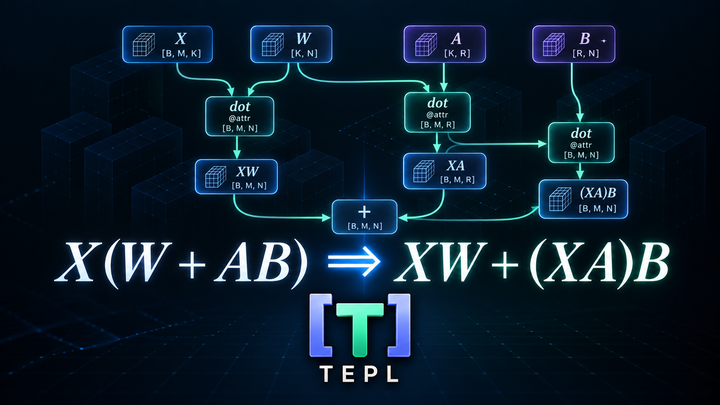
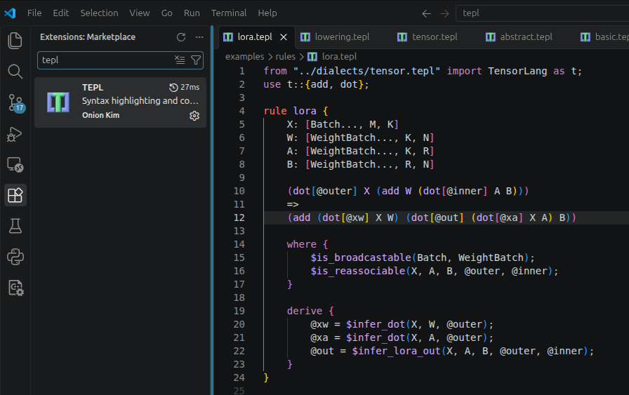

<h1> TEPL - Tensor Equality Pattern Language</h1>

<p align="center">
  
</p>

<p align="center">
  <a href="labs/rust-egg/README.md"></a>
  <a href="docs/tutorial/cpp/01_build.md"></a>
  <a href="https://egraphs-good.github.io/"></a>
  <a href="#-quick-start"></a>
  <a href="LICENSE"></a>
</p>

<p align="center"><strong>TEPL: <em>Write tensor rewrites that read like math.</em></strong></p>

<p align="center"><a href="https://5yearskim.github.io/tepl/">Official Documentation</a></p>

The same tensor computation can be expressed in different ways—with very different costs. In machine learning, choosing the right form can make a big difference: depending on tensor dimensions, `(XA)B` can require far less computation than `X(AB)`.

[E-graphs](https://en.wikipedia.org/wiki/E-graph) help optimizers explore those alternatives. They compactly represent many equivalent expressions, letting rewrite rules uncover more ways to perform a computation.

[egg](https://egraphs-good.github.io/) brings this approach to Rust with a fast, flexible e-graph library for building optimizers. But applying it to tensor computations introduces a challenge: the rules need to capture more than the operations alone.

## 😢 Tensor rewrites need more than symbols

Symbolic expressions make egg easy to use and powerful: operation names and nested operands can describe everything from simple arithmetic to complex computation graphs. Its Rust macros let you define your own operators and express rewrites in just a few lines. For example, moving negation through a transpose:

```rust
use egg::{define_language, rewrite, Rewrite};

// Define symbolic operators and their arity without writing the language implementation.
define_language! {
    enum Math {
        "transpose" = Transpose(egg::Id),
        "negate" = Negate(egg::Id),
        Symbol(egg::Symbol),
    }
}

// Express both sides as compact symbolic expressions; ?x captures any subexpression.
let rule: Rewrite<Math, ()> = rewrite!(
    "transpose-negate";
    "(transpose (negate ?x))" => "(negate (transpose ?x))"
);
```

But which axes does `transpose` permute? Swapping axes `(1, 0)` is different from swapping axes `(2, 1)`. For a rank-three tensor, these swaps correspond to permutations `[1, 0, 2]` and `[0, 2, 1]`, respectively. The symbol `transpose` alone does not tell us which one we mean.

Now consider reassociating matrix multiplication:

```text
(matmul (matmul ?x ?a) ?b)
=>
(matmul ?x (matmul ?a ?b))
```

As humans, we recognize the familiar identity `(XA)B = X(AB)` for compatible matrices under exact arithmetic. But consider what the rewrite engine sees: two `matmul` operations in the pattern and two in the replacement. When represented as general tensor contractions, each operation carries its own attributes, including the contracting dimensions of its left and right operands. Those attributes may need to change after reassociation. Which original operation supplies the attributes for each new one, and which values must be recomputed? This expression does not say.

There is another missing detail: what is `?x`? We intend it to be a tensor, but what is its shape or dtype? Many tensor operations need that information to determine whether their inputs are compatible and what shape and dtype their outputs will have. A rewrite also needs to respect numerical semantics, such as whether floating-point reassociation is allowed.

That is why tensor IRs carry more than operation names: [StableHLO](https://openxla.org/stablehlo/spec) and [ONNX](https://onnx.ai/onnx/operators/onnx__Transpose.html) represent operation attributes alongside tensor type information. A tensor rewrite must account for those details too.

> **Operation symbols alone are too abstract to fully describe tensor rewrites. Attributes and shape/dtype transformations must also be explicit.**

egg can represent these details, but the compact expressions above leave their representation and handling to us.

## 😭 Pattern rewriting in Rust is painful

You might ask, "Why not define the pattern directly in Rust instead of using symbolic expressions?"

Yes, you can. Custom matchers and appliers can handle the attributes, tensor metadata, and legality checks in detail. But the complete pattern and rewrite logic quickly becomes verbose and complex. Here is the earlier transpose-negate rule using this repository's Rust tensor runtime:

<details>
<summary><strong>👉 See the equivalent Rust rewrite</strong></summary>

```rust
// 👀 No need to follow every line! This example shows how verbose
// 👀 a simple tensor rewrite becomes when defining patterns by hand in Rust.

use egg::Var;
use rust_egg::ir::{DType, OpAttrs, dialects::tensor_lang::Op};
use rust_egg::ir::analysis::{infer_tensor_output, tensor_info};
use rust_egg::ir::rewriting::{
    AttrExpr, AttrPattern, AttrVar, TensorExpr, TensorPattern, tensor_rewrite_checked,
};

let x: Var = "?x".parse().unwrap();
let perm = AttrVar::from("perm");

// Match transpose(negate(x)), capturing the transpose's permutation.
// Each operator needs explicit attributes and a nested vector of child patterns.
let lhs = TensorPattern::op(
    Op::Transpose,
    AttrPattern::Bind(perm),
    vec![TensorPattern::op(
        Op::Negate,
        AttrPattern::Exact(OpAttrs::None),
        vec![TensorPattern::Var(x)],
    )],
);

// Build negate(transpose(x)), reusing x and the captured permutation.
// The replacement requires a separate expression tree with the nesting reversed.
let rhs = TensorExpr::op(
    Op::Negate,
    AttrExpr::Exact(OpAttrs::None),
    vec![TensorExpr::op(
        Op::Transpose,
        AttrExpr::Captured(perm),
        vec![TensorExpr::Var(x)],
    )],
);

// Connect the two trees and check that the replacement preserves shape and dtype.
let rule = tensor_rewrite_checked(
    "transpose-negate",
    lhs,
    rhs,
    tensor_info,
    infer_tensor_output,
    move |graph, matched| {
        // Apply only to f32 inputs, matching the TEPL declaration below.
        let input = tensor_info(graph, matched.tensors[x])?;
        (input.dtype == DType::F32).then_some(Default::default())
    },
).unwrap();
```

</details>

Even this simple rewrite needs separate nested trees for the pattern and replacement, explicit attribute bindings, and metadata checks. As patterns grow, the repeated constructors and bookkeeping make the mathematical rule harder to see, review, and maintain.

## ✨ Write a rule in TEPL, a language dedicated to tensor rewrites

TEPL lets you express the rule, its attributes, and its tensor constraints together, then generates Rust code for egg or C++ code for [egg-c](https://github.com/5yearsKim/egg-c). Both backends support attribute capture, shape/dtype analysis, and multiple dialects.

Here is the complete TEPL rule, using the example tensor dialect. Save it as `examples/sample/rules/transpose_negate.tepl`:

```javascript
from "../dialects/tensor.tepl" import TensorLang as t;

rule transpose_negate {
    X: f32[Dims...]

    (t.transpose[@perm] (t.negate X))
    =>
    (t.negate (t.transpose[@perm] X))
}
```

TEPL keeps tensor rewrites concise while supporting the features needed for real tensor optimizations:

- **Readable rules:** Write the match and replacement directly, without manually building nested Rust trees.
- **Attribute capture and reuse:** `@perm` carries the transpose attributes from the match into the replacement.
- **Shape and dtype analysis:** `f32[Dims...]` matches an `f32` tensor of any rank; generated checks require the replacement to preserve the output shape and dtype.
- **Custom rewrite conditions:** Use `where` to express legality checks and `derive` to compute new attributes.
- **Multiple dialects:** Define and import your own operation dialects, and write rules that rewrite between them.
- **Host function bindings:** Implement complex logic in Rust or C++ and call it from TEPL with `$function(...)` in `where` and `derive` blocks.
- **E-graph integration:** Generate rewrites for egg or egg-c, with generated tensor analysis or hooks for your own analysis and inference.

## 📉 A smaller computation with LoRA

The [LoRA example](labs/rust-egg/README.md#lora-saturation-example) uses TEPL-generated rules with egg to explore equivalent expressions and select one with a lower estimated arithmetic cost. Here, `@` denotes matrix multiplication.

| | Expression | Estimated arithmetic operations |
| --- | --- | ---: |
| Before | `X @ (W + A @ B)` | 69,632 |
| After | `X @ W + (X @ A) @ B` | 39,168 |

That's **about 44% fewer estimated arithmetic operations** for input shapes `X=[2,4,64]`, `W=[2,64,32]`, `A=[2,64,4]`, and `B=[2,4,32]`. The demo checks equal results using deterministic integer inputs; floating-point reassociation is controlled by the host's legality policy.

Read the [TEPL rule](examples/sample/rules/lora.tepl) or reproduce the result from the repository root:

```sh
cargo run --manifest-path labs/rust-egg/Cargo.toml --example lora_saturation
```

## 🚀 Quick start

Try it from the repository root:

```sh
bazel build //:tepl
bazel-bin/tepl check examples/sample
bazel-bin/tepl generate examples/sample --out my_app/src/generated
```

Start a new TEPL project with `tepl init <directory>` (use `.` for the current
directory):


## 💡 Tips

Write rules with less friction: the TEPL extension for VS Code brings syntax
highlighting and code formatting to your editor.

<p align="center">
  
</p>

## 📚 More on…

- [🧭 Design philosophy](https://5yearskim.github.io/tepl/design_philosophy/) — The principles behind TEPL's language design.
- [🧠 Core concepts](https://5yearskim.github.io/tepl/2_core_concept_tepl/) — Understand TEPL's tensor patterns and rewrite rules.
- [🦀 Rust tutorial](https://5yearskim.github.io/tepl/tutorial/rust/01_build/) — Build TEPL and get started with tensor rewrites in Rust.
- [🛠️ Developer guide](https://5yearskim.github.io/tepl/developer_guide/) — Build, test, and contribute to TEPL.
