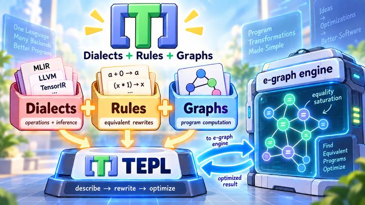

# Core concepts: dialects, rules, and graphs

TEPL describes graph rewriting through three concepts:

| Concept | What it describes |
| --- | --- |
| **Dialect** | A set of operations, their attributes, and shape/dtype inference. |
| **Rule** | A pattern of operations and an equivalent replacement. |
| **Graph** | A concrete computation to optimize, with inputs and an output. |

Rules and graphs use operations defined by dialects. TEPL generates code from
these declarations. The host application loads the graph into an e-graph engine,
applies the rules through **equality saturation**, and extracts a result using
its cost model.

<figure markdown="1">
{ width="720" }
</figure>

## One example, three parts

Suppose we want to simplify a tensor computation containing two consecutive
negations. Put the declarations in a small project:

```text
my_project/
├── dialects/math.tepl
├── rules/simplify.tepl
└── graphs/example.tepl
```

### 1. Dialect: define the operations

In `dialects/math.tepl`, define elementwise addition and sign reversal:

```javascript
dialect Math {
    op add(lhs: tensor, rhs: tensor) -> tensor {
        dtype(a, b) {
            assert a == b;
            assert is_float(a);
            yield a;
        }
        shape(a, b) {
            assert a == b;
            yield a;
        }
    }

    op negate(input: tensor) -> tensor {
        dtype(t) {
            assert is_float(t);
            yield t;
        }
        shape(s) {
            yield s;
        }
    }
}
```

`add` takes two tensors with identical shapes and floating-point dtypes.
`negate` preserves its input's shape and dtype. The `dtype` and `shape` blocks
define metadata checks and inference; the host gives these operations their
computational meaning.

### 2. Rules: describe equivalent computations

In `rules/simplify.tepl`, import the dialect and write two rewrites:

```javascript
from "../dialects/math.tepl" import Math as m;

rule cancel_double_negate {
    X: f32[N, M]

    (m.negate (m.negate X)) => X
}

rule commute_add {
    X: f32[N, M]
    Y: f32[N, M]

    (m.add X Y) => (m.add Y X)
}
```

An expression such as `(m.add X Y)` puts the operation first, followed by its
operands. Nesting expresses a sequence of operations.

`=>` separates the matched pattern from the replacement. `X` and `Y` are matched
tensors, reused on the right. Here, they must be rank-two `f32` tensors. `N` and
`M` bind their dimensions; using the same names requires matching dimensions.

The first rule removes two negations. The second adds an alternative operand
order. Neither rule names a particular graph input: these patterns can match
any compatible tensors in the host e-graph.

### 3. Graph: provide a computation to optimize

In `graphs/example.tepl`, construct a graph using the same dialect:

```javascript
from "../dialects/math.tepl" import Math as m;

graph example {
    input X: f32[2, 3];
    input Y: f32[2, 3];

    let restored = (m.negate (m.negate X));
    let sum = (m.add restored Y);

    yield (m.add sum sum);
}
```

`input` declares external tensors with concrete metadata. `let` names an
intermediate value, and `yield` selects the graph's output. Both references to
`sum` share the same value, so this describes a graph with shared computation.
The host supplies the actual tensor values.

The graph imports its operations. The host separately selects the rules to
apply to it.

## How the host brings them together

Check and generate the project:

```sh
tepl check my_project
tepl generate my_project --out my_app/src/generated
```

The default target is Rust for `egg`; C++ generation supports `egg-c`. The
generated code provides operation types, metadata inference, rewrite builders,
and graph constructors.

The host then:

1. Builds the starting graph and supplies its input metadata to the analysis.
2. Inserts it into the e-graph and selects the generated rewrite rules.
3. Runs equality saturation until saturation or a configured limit.
4. Extracts a result according to its cost model.

For this example, the e-graph can represent these equivalent forms of `sum`:

```text
(m.add (m.negate (m.negate X)) Y)
(m.add X Y)
(m.add Y X)
```

The original form remains available alongside the alternatives. A cost model
that favors fewer operations can select the form without negations. The final
output still adds the shared `sum` to itself.

**Dialect operations give the graph its vocabulary. Rules describe equivalences.
The graph supplies the starting computation. The host runs the optimization.**

Next: run the generated code in [Rust](tutorial/rust/02_run.md) or
[C++](tutorial/cpp/02_run.md), explore
[concrete graph examples](../examples/sample/graphs/README.md), or read the
[CLI reference](references/cli.md).
