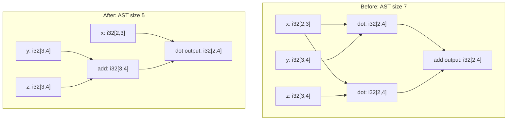

# 🔎 Add tensor shape and dtype analysis

Continue from [Run your first TEPL code](02_run.md), using the same C++
project, egg-c dependency, and `src/utils.h`.

The basic example declares operations and graph structure, but supplies no
input shapes or dtypes and no inference programs. Its e-classes have no tensor
metadata. TEPL supports both shape and dtype analysis: declare input types,
describe how operations infer output types, and pass `TensorAnalysis` to egg-c.

The reference TEPL files are in
[`pattern_analyze`](../../../labs/tutorial_cpp/pattern_analyze), and the C++ app
is [analyze.cpp](../../../labs/tutorial_cpp/src/analyze.cpp). This uses the same
TEPL source as the [Rust analysis tutorial](../rust/03_analyse.md) and factors
two matrix products:

```text
add(dot(x, y), dot(x, z)) => dot(x, add(y, z))
```

From your existing project root, copy the basic TEPL project:

```sh
cp -R pattern_basic pattern_analyze
```

## 1. Add shape and dtype programs

Replace `pattern_analyze/dialects/my_dialect.tepl` with:

```javascript
dialect MyDialect {
    op add(lhs: tensor, rhs: tensor) -> tensor {
        dtype(a, b) {
            assert a == b && is_numeric(a);
            yield a;
        }
        shape(l, r) {
            assert l == r;
            yield l;
        }
    }

    // Matrix product: [M, K] x [K, N] -> [M, N].
    op dot(lhs: tensor, rhs: tensor) -> tensor {
        // Contract lhs axis 1 with rhs axis 0.
        attrs { axis: index; }
        dtype(a, b) {
            assert a == b && is_numeric(a);
            yield a;
        }
        shape(l, r) {
            assert len(l) == 2 && len(r) == 2;
            assert attrs.axis == 1 && l[1] == r[0];
            yield [l[0], r[1]];
        }
    }
}
```

Each program receives metadata in operand order. Its arguments are shape
lists or dtype values, rather than tensor data. For `add` with two `f32[2, 3]`
operands:

| Program | Arguments | Result |
| --- | --- | --- |
| `shape(l, r)` | `l: [2, 3]`, `r: [2, 3]` | `[2, 3]` |
| `dtype(a, b)` | `a: f32`, `b: f32` | `f32` |

`assert` validates a relationship; `yield` supplies the result metadata.
Addition requires equal shapes and matching numeric dtypes. Matrix dot checks
that the contracting dimensions agree, then produces `[left rows, right columns]`.
Its dtype program preserves the operands' shared dtype.

Parameter names are local to each program. TEPL does not infer semantics from
an operation's name; these blocks define the metadata relationships.

## 2. Constrain rewrite matches

Replace `pattern_analyze/rules/add_dot.tepl` with:

```javascript
from "../dialects/my_dialect.tepl" import MyDialect as d;

rule associate_add {
    (d.add (d.add X Y) Z) => (d.add X (d.add Y Z))
}

rule swap_add {
    (d.add X Y) => (d.add Y X)
}

rule swap_dot {
    (d.dot[@dot] X Y) => (d.dot[@dot] Y X)

    where {
        $supports_axis(@dot.axis);
    }
}

abstract rule factor_dot() {
    dtype T;
    X: T[M, K]
    Y: T[K, N]
    Z: T[K, N]

    (d.add (d.dot[@left] X Y) (d.dot[@right] X Z))
        => (d.dot[@left] X (d.add Y Z))

    where {
        @left.axis == @right.axis;
    }
}

rule factor_small_dot extends factor_dot() {
    where { K <= 8; }
}
```

Tensor declarations inside a rule are **matching conditions**. For example:

| Declaration | Required metadata for capture `X` |
| --- | --- |
| `X: [2, 3]` | Shape `[2, 3]`; any dtype |
| `X: f32` | Dtype `f32`; any shape |
| `X: f32[2, 3]` | Both dtype `f32` and shape `[2, 3]` |
| `dtype T; X: T[M, K]` | Bind a dtype and two dimensions from a rank-2 tensor |

If a candidate's metadata does not match, the search discards that branch.
Missing or invalid metadata also prevents a constrained match. Declarations
filter matched tensors; they do not reshape them or convert their dtype.
Captures can refer to input tensors or intermediate results.

In `factor_dot`, repeated `T` requires all three captures to share a dtype.
Repeated `K` connects the left matrix's columns to the right matrices' rows;
the two right matrices also share `N`. The rule can match different concrete
dtypes and dimensions without duplicating its pattern.

`factor_small_dot` inherits that pattern, its declarations, and its axis check,
then adds `K <= 8`. A valid product with `K = 16` still builds, but this rule
does not match it. Only concrete rules are instantiated as C++ rewrites.

The basic rules remain available. The C++ `$supports_axis` callback accepts only
axis `0`, so `swap_dot` rejects this example's axis-`1` matrix products.
Matrix multiplication generally does not commute. The factoring demo uses
`i32` matrices with wrapping arithmetic. This describes the tensors' value
semantics; an `i32` declaration does not make native C++ signed arithmetic wrap.

### Reuse general rewrite properties

Rule polymorphism also supports **operation parameters**. For a dialect `d`
with elementwise `add` and `multiply` operations, both using the shape and dtype
programs shown for `add`, one template can express commutativity:

```javascript
abstract rule commute(F: op<(tensor, tensor) -> tensor>) {
    dtype T;
    X: T[M, N]
    Y: T[M, N]

    (F X Y) => (F Y X)
}

rule commute_add extends commute(F = d.add);
rule commute_multiply extends commute(F = d.multiply);
```

`F` accepts a binary tensor operation. Each concrete rule substitutes its
operation while retaining the same shape and dtype constraints. Keep the
template and its instances in the same rule file, with the dialect import.

This is useful for shared properties such as commutativity and associativity.
An associative template would use `(F (F X Y) Z) => (F X (F Y Z))`.
Instantiate such templates for operations whose numerical semantics permit
the property; matching metadata alone does not establish value equivalence.
The `multiply` example illustrates reuse and is not needed for the matrix demo.

## 3. Declare input metadata in the graph

Replace `pattern_analyze/graphs/add_dot_sample.tepl` with:

```javascript
from "../dialects/my_dialect.tepl" import MyDialect as d;

graph add_dot_sample {
    input x: i32[2, 3];
    input y: i32[3, 4];
    input z: i32[3, 4];

    let a = (d.dot[axis = 1] x y);
    let b = (d.dot[axis = 1] x z);
    yield (d.add a b);
}
```

The inputs now carry shape and dtype declarations. These describe tensor
types, not numerical values. Both dot products infer `i32[2, 4]`, and their
addition preserves that type. For the inherited rule, the captures bind
`T = i32`, `M = 2`, `K = 3`, and `N = 4`.

## 4. Enable analysis in C++

Generate the new headers:

```sh
tepl check pattern_analyze
tepl generate pattern_analyze --target cpp \
  --cpp-namespace tepl_pattern_analyze \
  --out src/tepl_pattern_analyze --no-format
```

Add `/src/tepl_pattern_analyze/` to `.gitignore`. Download the reference
[analyze.cpp](../../../labs/tutorial_cpp/src/analyze.cpp) as `src/analyze.cpp`,
keeping `src/utils.h` from the previous guide. Its includes select the new
project and give it the alias expected by the shared printer:

```cpp
#include "tepl_pattern_analyze/generated.h"
namespace tepl = tepl_pattern_analyze;
#include "utils.h"
```

The main change from the basic app is the analysis passed to egg-c:

```cpp
auto graph_def = tepl::graphs::add_dot_sample::graph_add_dot_sample::build();
auto bindings = graph_def.input_bindings();
auto analysis = tepl::TensorAnalysis(std::move(bindings));
eggc::EGraph<tepl::OpNode, tepl::TensorAnalysis> graph{std::move(analysis)};
auto built = graph_def.insert_nodes(graph);
```

`input_bindings()` collects complete input types from the graph declarations.
`TensorAnalysis` registers them before insertion. Passing these objects with
`std::move` lets the constructors take ownership of the binding table and
analysis. The basic app uses `eggc::NoAnalysis<tepl::OpNode>`; this app uses
`tepl::TensorAnalysis`.

The generated analysis evaluates each operation's shape and dtype programs.
egg-c stores the resulting metadata in each e-class and updates it as rewrites
add alternatives and merge classes. Metadata is available when the alternatives
are all known and agree.

`insert_nodes()` rebuilds the graph before returning, so its metadata is ready
to inspect. If you insert or merge nodes manually, call `graph.rebuild()` to
update metadata and restore a clean graph. Lookups, e-class enumeration, and
extraction require that clean state.

The app runs all four concrete rules. Its `r` alias names
`tepl::rules::add_dot`:

```cpp
std::vector rules{
    r::rule_associate_add::build(),
    r::rule_swap_add::build(),
    r::rule_swap_dot::build(Host{}),
    r::rule_factor_small_dot::build(),
};
auto report = eggc::run(graph, rules);
```

Here, `build()` defaults to the same `TensorAnalysis` used by the graph.
The basic app needed `build<Analysis>()` to select `NoAnalysis` explicitly.
Rules without host callbacks use their default empty host argument.

The app reads metadata with `tensor_info(graph, id)`. This returns
`std::optional<TensorInfo>`; `.value()` obtains the known type and throws if
metadata is unavailable. Named handles from `built.get(name)` and node lookups
also return optionals. They play the same role as Rust's `Option` and
`.unwrap()` in the reference example.

Extraction defaults to AST size, so this code selects the factored expression:

```cpp
auto after_info = tensor_info(graph, built.root).value();
auto [after_size, after] = eggc::Extractor(graph).find_best(built.root);
```

This cost corresponds to Rust's `AstSize`, counting expression nodes,
including repeated inputs. Create a new extractor after rewriting: an egg-c
extractor is tied to the graph state in which it was constructed.

To inspect the new `add(y, z)`, the reference app constructs a node and looks
it up:

```cpp
auto sum = tepl::OpNode::make(d::Op::Add, {},
                            {built.get("y").value(), built.get("z").value()});
auto sum_id = graph.lookup(sum).value();
auto info = tensor_info(graph, sum_id).value();
```

`d` aliases `tepl::dialects::my_dialect`. C++ uses `OpNode::make` where Rust
uses `OpNode::new`, because `new` is a C++ keyword. The empty attribute argument
is appropriate for `add`; dot attributes use the dialect's `DotAttrs` struct.

The app compares before and after expressions and checks that output shape
and dtype agree. Its `utils::require` checks stay active in release builds,
where standard C++ `assert` can be disabled. The program rewrites graphs and
infers types; it does not evaluate tensor values.

Append the second binary to your existing `CMakeLists.txt`:

```cmake
add_executable(pattern_analyze src/analyze.cpp)
target_link_libraries(pattern_analyze PRIVATE eggc::eggc)
target_compile_features(pattern_analyze PRIVATE cxx_std_20)
set_target_properties(pattern_analyze PROPERTIES CXX_EXTENSIONS OFF)
add_test(NAME pattern_analyze COMMAND pattern_analyze)
```

Configure and run it:

```sh
cmake -S . -B build -DCMAKE_BUILD_TYPE=Debug
cmake --build build --target pattern_analyze -j2
./build/pattern_analyze
```

Run generation again after editing the TEPL files. Both binaries can be checked
with `cmake --build build -j2` followed by
`ctest --test-dir build --output-on-failure`.

To try the reference app instead, run from the repository root:

```sh
cmake -S labs/tutorial_cpp -B labs/tutorial_cpp/build -DCMAKE_BUILD_TYPE=Debug
cmake --build labs/tutorial_cpp/build --target pattern_analyze -j2
labs/tutorial_cpp/build/pattern_analyze
```

## 🔎 Read the inferred result

Here is how the shapes flow through the two equivalent expressions:



One run prints the following excerpt; other e-classes are omitted:

```text
  x: i32[2, 3]
  y: i32[3, 4]
  z: i32[3, 4]
  dot(x, y): i32[2, 4]
  dot(x, z): i32[2, 4]
Stop reason: Saturated

Saturated e-graph (nodes in each e-class are equivalent):
...
e5: i32[2, 4] (root)
  add(e3, e4)
  add(e4, e3)
  dot[axis=1](e0, e7)
e7: i32[3, 4]
  add(e1, e2)
  add(e2, e1)

  Factored add(y, z): i32[3, 4]
Before: add(dot[axis=1](x, y), dot[axis=1](x, z)) (AST size 7)
After:  dot[axis=1](x, add(y, z)) (AST size 5)
Output: i32[2, 4]
```

The root class `e5` contains both the original addition and the factored dot.
Every alternative agrees on `i32[2, 4]`. Class `e7` contains the new `add(y, z)`
with type `i32[3, 4]`; its two operand orders come from `swap_add`.
The inferred dimensions validate the new product: `[2, 3] × [3, 4] → [2, 4]`.

The minimum AST size falls from **7 to 5**. The shared `x` appears twice in the
original expression tree, so both occurrences count toward its cost.
This is a structural cost, not a runtime measurement. `Saturated` means another
rewrite pass found no new equivalences. E-class IDs and tied operand orders
may vary between runs.

The shared C++ printer keeps `axis` visible in extracted expressions. Its output
and e-class IDs may differ from Rust's display; the inferred types and minimum
costs agree. See the [C++ runtime guide](../../../templates/cpp/README.md) for
custom analyses and more advanced host integration.
